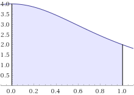

Calculate PI
============

This program calculates PI using a definite integral and the fact that:

You can see this for yourself on [WolframAlpha](https://www.wolframalpha.com/input/?i=integrate%284%2F%281+%2B+x%5E2%29%2C0%2C1%29).

Assignment
----------

Your goal is to apply your knowledge of machine architectures to alter this program to make it run faster.

There are many ways that this program could be adjusted to make it more performant. If you are finding yourself stuck, you might want to check out [loop unrolling](https://en.wikipedia.org/wiki/Loop_unrolling) as possible tweak.

Please comment your code to indicate what you changed and why this change improved performance.
